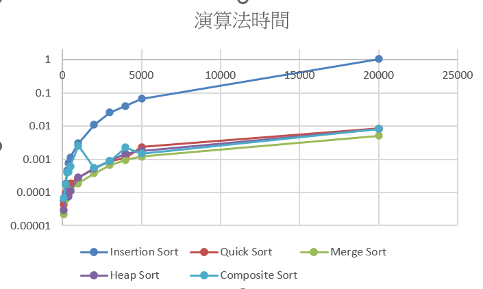
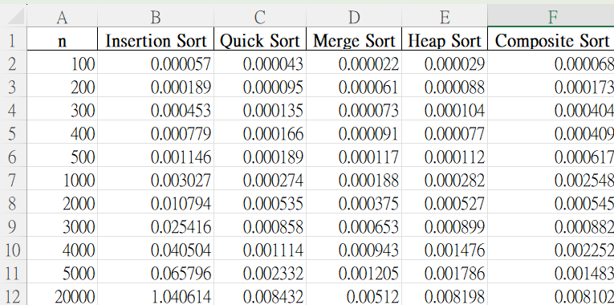

# 排序演算法時間比較報告

## 測試資料筆數
測試範圍從 100 筆至 20000 筆，每種排序法測試同一組隨機資料來源。

---

## 結果

| n     | Insertion Sort | Quick Sort | Merge Sort | Heap Sort | Composite Sort |
|-------|----------------|------------|------------|-----------|----------------|
| 100   | 0.000057       | 0.000043   | 0.000022   | 0.000029  | 0.000068       |
| 200   | 0.000189       | 0.000095   | 0.000061   | 0.000088  | 0.000173       |
| 300   | 0.000453       | 0.000135   | 0.000073   | 0.000104  | 0.000404       |
| 400   | 0.000779       | 0.000166   | 0.000091   | 0.000077  | 0.000409       |
| 500   | 0.001146       | 0.000189   | 0.000117   | 0.000112  | 0.000617       |
| 1000  | 0.003027       | 0.000274   | 0.000188   | 0.000282  | 0.002548       |
| 2000  | 0.010794       | 0.000535   | 0.000375   | 0.000527  | 0.000545       |
| 3000  | 0.025416       | 0.000858   | 0.000653   | 0.000899  | 0.000882       |
| 4000  | 0.040504       | 0.001114   | 0.000943   | 0.001476  | 0.002252       |
| 5000  | 0.065796       | 0.002332   | 0.001205   | 0.001786  | 0.001483       |
| 20000 | 1.040614       | 0.008432   | 0.005120   | 0.008198  | 0.008102       |

---

## 對數時間成長圖

---

---

## 結論

根據結果來看，在資料數逐漸增加的情況下，Insertion Sort執行秒數隨著資料越來越多，成次方數發展，其他演算法因為平均時間為 O(n log n)，大部資料為線性成長。特別是 Quick Sort 在大多數情況下為最快，不過在資料筆數逐漸變大的話也不一定是做塊的，Merge Sort與 Heap Sort稍微落後，而 Composite Sort 介於其中，由資料筆數影響其結果，這次最多只測到20000筆資料未來可以分別測試資料筆數較大的時間。
