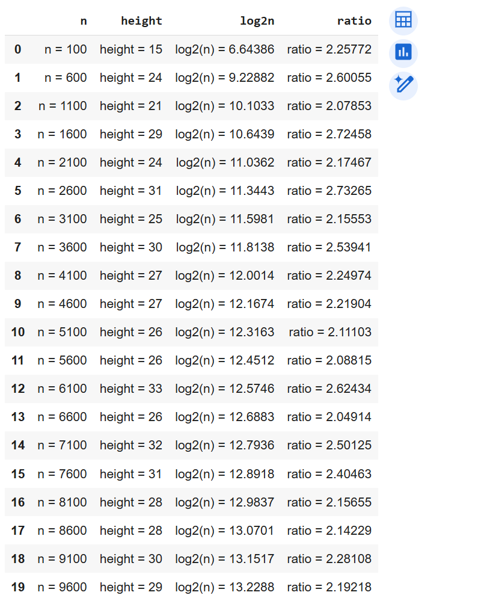

# 資料結構第二題Binary Search Tree

> (a.)Write a program to start with an initially empty binary search tree and make n random insertions. Use a uniform random number generator to obtain the values to be inserted. Measure the height of the resulting binary search tree and divide this height by log₂n. Do this for n = 100, 500, 1000, 2000, 3000, ..., 10,000. Plot the ratio height / log₂n as a function of n. The ratio should be approximately constant (around 2). Verify that this is so.
---

``` cpp
#include <iostream>
#include <cmath>
#include <cstdlib>
#include <ctime>
using namespace std;

struct Node {
    int val;  // node 值 
    Node* left;   //左子樹
    Node* right;  //右子樹
};

Node* insert(Node* root, int x) {
    if (root == nullptr) {
        root = new Node;
        root->val = x;
        root->left = nullptr;
        root->right = nullptr;
        return root;
    }
    if (x < root->val)
        root->left = insert(root->left, x);
    else
        root->right = insert(root->right, x);
    return root;
}

int getHeight(Node* root) {
    if (root == nullptr) return 0;
    int l = getHeight(root->left);
    int r = getHeight(root->right);
    return max(l, r) + 1;
}

int getRandom(int min, int max) {
    return rand() % (max - min + 1) + min;
}

int main() {
    srand(time(0));

    for (int n = 100; n <= 10000; n += 500) {
        Node* root = nullptr;
        for (int i = 0; i < n; i++) {
            int x = getRandom(1, n * 10);
            root = insert(root, x);
        }
        int h = getHeight(root);
        double logn = log2(n);
        double ratio = h / logn;
        cout << "n = " << n << ", height = " << h << ", log2(n) = " << logn << ", ratio = " << ratio << endl;
    }

    return 0;
}

```
## 輸出結果


## 驗結果圖表
> 利用pytho 將資料可視化
``` python
import pandas as pd
import matplotlib.pyplot as plt

data = pd.read_csv("bst_ratio.csv")

plt.figure(figsize=(10, 6))
plt.plot(data["n"], data["ratio"], marker='o')
plt.xticks(data["n"], rotation=45)
plt.xlabel("n")
plt.ylabel("height / log2(n)")
plt.title("BST Height vs log2(n) Ratio")
plt.grid(True)

for i in range(len(data)):
    plt.text(data["n"][i], data["ratio"][i], f'{data["ratio"][i]:.2f}', fontsize=8, ha='right')

plt.tight_layout()
plt.show()
```


>(b.刪除結點)

1. **沒有子節點 → 直接刪除**

2. **有一個子節點 → 用子節點取代**

3. **有兩個子節點 → 找右子樹最小值（或左子最大值）取代，然後遞迴刪除**

``` cpp 
#include <iostream>
using namespace std;

struct Node {
    int key;
    Node* left;
    Node* right;
};

Node* findMin(Node* root) {
    while (root->left != nullptr)
        root = root->left;
    return root;
}

Node* deleteNode(Node* root, int k) {
    if (root == nullptr) return nullptr;

    if (k < root->key) {
        root->left = deleteNode(root->left, k);
    } else if (k > root->key) {
        root->right = deleteNode(root->right, k);
    } else {
        // 找到節點
        if (root->left == nullptr && root->right == nullptr) {
            delete root;
            return nullptr;
        } else if (root->left == nullptr) {
            Node* temp = root->right;
            delete root;
            return temp;
        } else if (root->right == nullptr) {
            Node* temp = root->left;
            delete root;
            return temp;
        } else {
            Node* temp = findMin(root->right);
            root->key = temp->key;
            root->right = deleteNode(root->right, temp->key);
        }
    }
    return root;
}

```

>在這個刪除節點的函式中，主要的時間花費是在從樹的上方一路搜尋到目標節點，然後根據節點的情況做對應的刪除處理。這樣的操作最主要的時間取決於樹的高度（h）。
如果這棵二元搜尋樹是平均分布的，那麼高度大約是 log₂(n)，此時刪除的時間是 O(log n)，執行效率很好。但如果這棵樹退化成一條線（像是一直插入遞增或遞減的數字），那就可能要一路找到底，變成 O(n)，效率就會比較差。

因此，這個函式的時間複雜度是 O(h)，其中 h 是樹的高度，最好的情況是 O(log n)，最壞的情況是 O(n)。